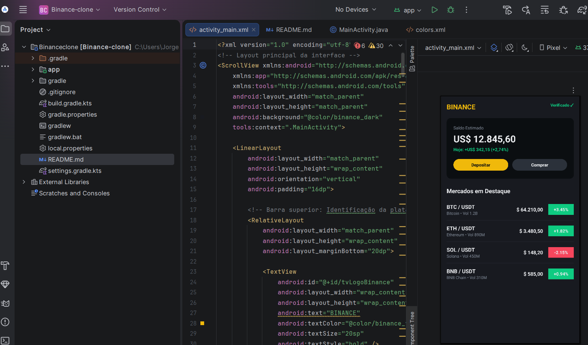

# Interface Móvel - Clone Binance (Dashboard)

Projeto prático desenvolvido para a disciplina de Desenvolvimento de Aplicações Móveis. O objetivo consistiu na configuração do ambiente de desenvolvimento (Android Studio e Android SDK) e na implementação de uma interface gráfica estática inspirada na plataforma de investimentos Binance.

## Funcionalidades da Interface
- **Tema Escuro (Dark Mode):** Aplicação de paleta de cores corporativa da Binance.
- **Cartão de Resumo Financeiro:** Exibição de saldo total estimado, percentual de rentabilidade e botões rápidos de ação (`Depositar` e `Comprar`).
- **Lista de Cotações em Tempo Real:** Listagem dos principais pares de criptomoedas (`BTC`, `ETH`, `SOL`, `BNB`) com formatação visual de variação positiva (verde) e negativa (vermelho).
- **Rolagem Dinâmica:** Utilização de `ScrollView` para suporte a diferentes densidades e alturas de ecrã.

## Demonstração Visual

## Tecnologias Utilizadas
- **IDE:** Android Studio
- **Linguagem de Layout:** XML Nativo
- **Componentes:** `ScrollView`, `CardView`, `LinearLayout`, `RelativeLayout`
